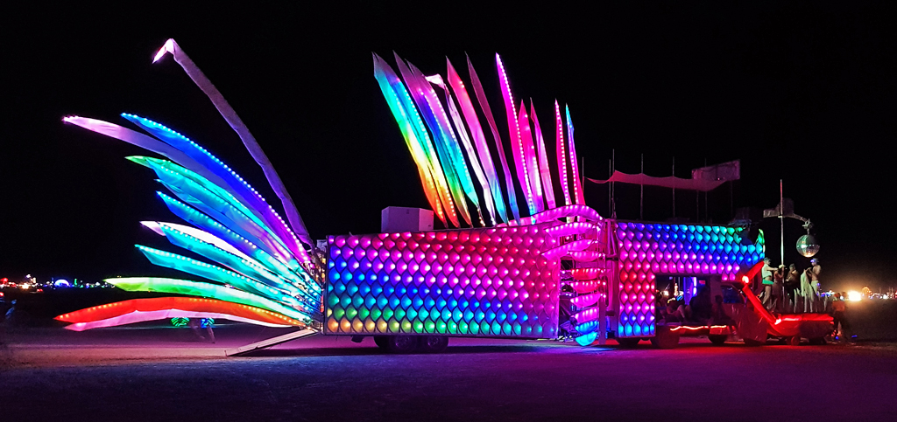
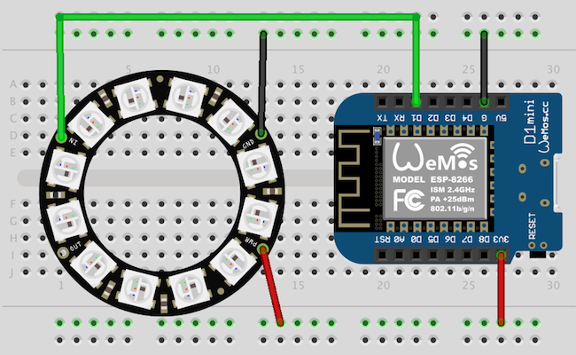

# Unisparks Library

[](https://travis-ci.org/unisparks/unisparks)

Unisparks is a library for generating network-synchronized LED patterns. 
You can use it in wearables, costumes, accessories, even robots and art cars. The library was originally developed
to control the shiny skin of the famous DiscoFish art car and furry-but-not-less-shiny vests of its crew. It is
also the core of LED control software on our new TechnoGecko art car.

If you're going to Burning Man and want to build a costume (or an art installation, or maybe even an art car)
that synchronizes with our art cars - this is the library to use. This document will explain you how.



## Quickstart

Here is an example of how to use the library to 
drive some [NeoPixels](https://www.adafruit.com/index.php?main_page=category&cPath=168) with ESP8266 board:

```c++
    #include <Unisparks.h>
    #include <Adafruit_NeoPixel.h>

    const int NUM_LEDS = 12;
    const int LED_PIN = 5; 
 
    Adafruit_NeoPixel strip(NUM_LEDS, LED_PIN, NEO_GRB + NEO_KHZ800);

    void renderPixel(int i, uint8_t r, uint8_t g, uint8_t b) {
        strip.setPixelColor(i, r, g, b);       
    }

    Unisparks::Player player;
    Unisparks::Matrix pixels(NUM_LEDS, 1);
    Unisparks::Esp8266WiFi network("myssid", "mypassword");

    void setup()
    {
      Serial.begin(115200);
      strip.begin();
      player.begin(pixels, renderPixel, network);
 
      pinMode(LED_PIN, OUTPUT);
    }

    void loop()
    {
      player.render(millis());
      strip.show();
      delay(10);
    }
```

## Installation

### Arduino

The easiest way is to download a [release](https://github.com/unisparks/unisparks/releases) as a `.zip` file, 
then run Arduino IDE, select `Sketch / Include Library / Add .ZIP library` from the menu and install the release.

Note that to compile examples you also need to install Adafruit Neopixel Library. You can do it from 
`Sketch / Include Library / Manage Libraries...`

### Linux

```shell
  # setup dependencies
  apt-get install -y build-essential cmake python git libglfw3-dev

  # clone and build 
  git clone git@github.com:unisparks/unisparks.git
  cd unisparks
  make 

  # run demo app
  ./build/bin/unisparks-demo 
```

### Mac

```shell
  # setup dependencies
  # make sure you have XCode and command-line tools installed
  brew install glfw3

  # clone and build 
  git clone git@github.com:unisparks/unisparks.git
  cd unisparks
  make 

  # run demo app
  ./build/bin/unisparks-demo 
```

## Testing on Arduino

If you want to try running sample Arduino sketch on an actual board, this is the most basic project you can start withh. It's similar to the classic blinking LED, except that one LED would be boring - so we'll blink 12 of them!

### Parts
  - *ESP8266 board*. I prefer [WeMos D1 Mini](https://www.aliexpress.com/item/ESP8266-ESP-12-ESP-12F-CH340G-CH340-V2-USB-WeMos-D1-Mini-WIFI-Development-Board-D1/32674463823.html?spm=a2g0s.9042311.0.0.3d714c4dn6YfQ9) because of it's small form-factor and dirt-cheap price, but if you don't feel like soldering headers or waiting for AliExpress shipments you can also use something like [Adafruit Feather Huzzah](https://www.adafruit.com/product/3046).
  - *Some WS2812B LEDs*. This sample uses [Adafruit Neopixel Ring](https://www.adafruit.com/product/1643), but you can use any of many compartible LED strips.
  - Breadboard and some jumper wire.

### Breadboard assembly

  - Connect power (`3V` pin on the board to `PWR` on Neopixel Ring) 
  - Connect grounds (`G` pin on the board to `GND` on Neopixel Ring)
  - Connect data (`D1` pin on the board to `IN` on Neopixel Ring) 

  

### Testing

 - open Arduino IDE and load the sample sketch onto the board
 - make sure your WiFi SSID & password is set in your sketch
 - run demo app on your laptop 

 You should see the pattern on your laptop synchronized to the Neopixel Ring.

## Contributing

See [CONTRIBUTING.md](CONTRIBUTING.md).

