# Orange Vest

The Orange Vest is the current design for TechnoGecko crew wearables.
They feature 360 individually addressable LEDs that change patterns
dynamically in sync with the main vehicle. The first vest using this
design was built in 2017, we then built 8 crew vests in 2018 and
dozens in 2021.

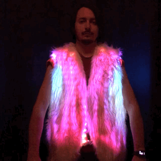

## Ingredients
  * Safety Vest (with mesh holes for zip ties, reinforcements and snap fasteners)
    * [Amazon](https://www.amazon.com/gp/product/B005FDOF76)
  * Furry Vest
    * Either buy furry fabric by the yard and make your own
    * Otherwise there are options on Amazon like [this one](https://www.amazon.com/gp/product/B077N7SZMH)
  * LED Strips (3x 16.4ft WS2812B 150 Pixels Waterproof Black PCB 30 LEDs/m)
    * We bulk-order them for camp cut to the right lengths
    * Otherwise you can get them on [Amazon](https://www.amazon.com/gp/product/B01LSF4Q00)
      but you'll need to cut them to the right length and solder JST connectors on the ends
  * Controller: M5Stack ATOM Matrix ESP32
    * Available cheaper from [M5Stack](https://shop.m5stack.com/collections/m5-atom/products/atom-matrix-esp32-development-kit)
    * In a rush, also available from [Amazon](https://www.amazon.com/dp/B078NQNXHD)
  * Grove Cable (20cm)
    * Available cheaper from [M5Stack](https://shop.m5stack.com/products/4pin-buckled-grove-cable?_pos=4&_sid=0f19af74e&_ss=r&variant=32050917081178)
    * In a rush, also available from [Amazon](https://www.amazon.com/dp/B01CNZ9RJO)
  * 3-pin JST Connectors
    * We need 5 females and 4 males per vest
    * [Amazon](https://www.amazon.com/dp/B00NBSH4CA)
  * Electric Wire (18 or 20 gauge, 3 colors)
    * Silicone wire is more flexible and better if available
    * [Enough for 3 vests from Amazon](https://www.amazon.com/dp/B08P5NB1XC)
    * [Enough for 15 vests from Amazon](https://www.amazon.com/dp/B089CW7YSR)
  * Electric Crimp Connectors (gauge matching wire)
    * We need 8 per vest
    * Lever connectors are easy to use [Amazon](https://www.amazon.com/dp/B07YWR55JT)
    * Otherwise butt connectors for crimping work better if crimped properly
  * Capacitor (between 1 and 5 milliFaradays)
    * [Amazon](https://amazon.com/gp/product/B07H55VB1L)
  * Electrical Tape
    * [Amazon](https://www.amazon.com/gp/product/B00004WCCL)
  * Zip-Ties (3 or 4-inch Black, 200 per vest)
    * [Amazon](https://www.amazon.com/dp/B078NT5F2B)
  * USB Cable (needs to be able to handle 2.4A)
    * [Amazon](https://www.amazon.com/dp/B08PQG7F32)
  * USB Battery (5V, at least 2.1A)
    * [10Ah, lasts 4 hours](https://www.amazon.com/gp/product/B00VWV8LD4)
    * [10Ah, lasts 4 hours, has USB-C](https://www.amazon.com/dp/B07YB9K7WJ)
    * [5Ah, lasts 2 hours](https://www.amazon.com/dp/B0862231VG)

## Tools Required
  * Scissors
  * [Wire Cutter](https://amazon.com/gp/product/B00FZPDG1K)
  * [Crimper](https://amazon.com/gp/product/B000JNNWQ2)
  * [Stripper](https://amazon.com/gp/product/B005JVJDIA)
  * Soldering Iron

## Instructions

### Prepare the Vest ("Mass Production Phase 1")

The safety vests from the Ingredients section above comes with external pockets
that are made of non-mesh fabric; those need to be removed to allow us to zip-tie
the LED strips to the vest. Be careful when cutting these off: make sure the vest
still holds together; in particular, removing the horizontal stitching on the back
can cause two pieces of mesh to come apart, if that happens use zip ties to
reattach them. You'll also need to remove the reflective gray strips: cut a small
hole in it then enlarge it with scissors and then you can rip it off. See pictures:

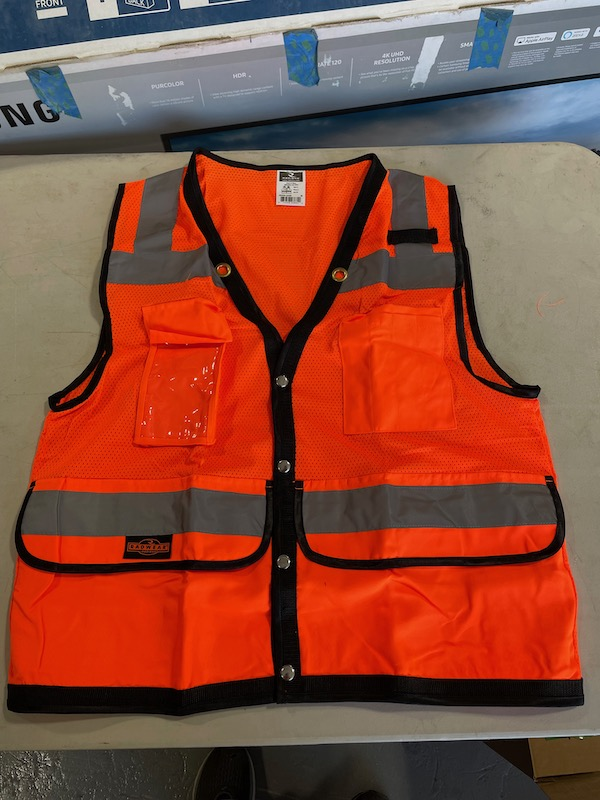
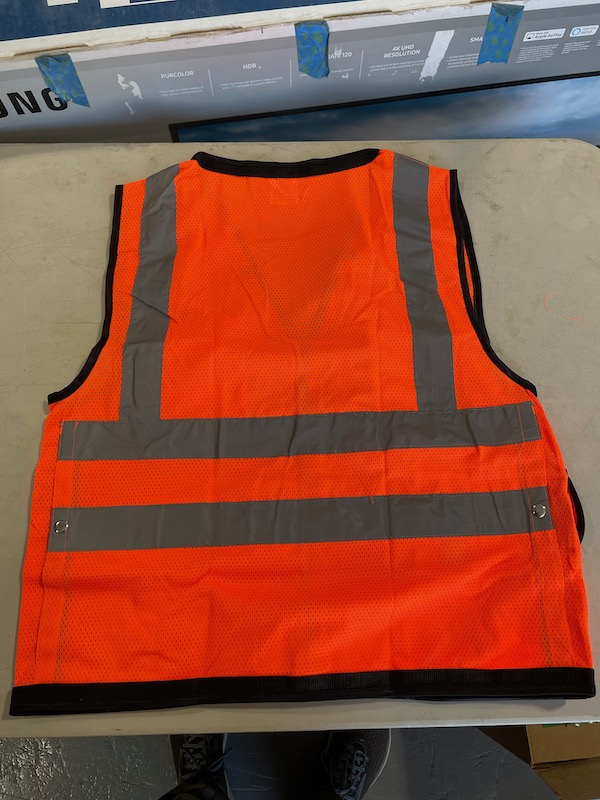
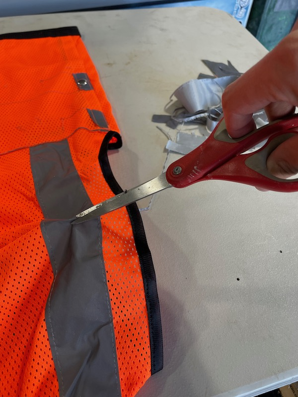
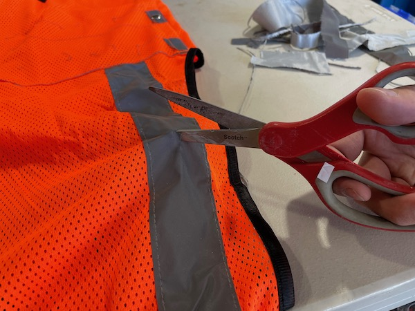
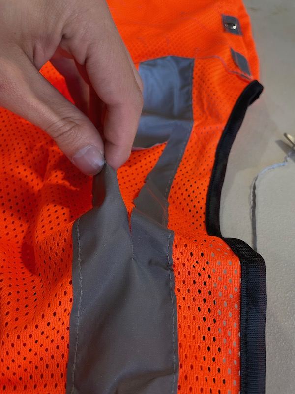
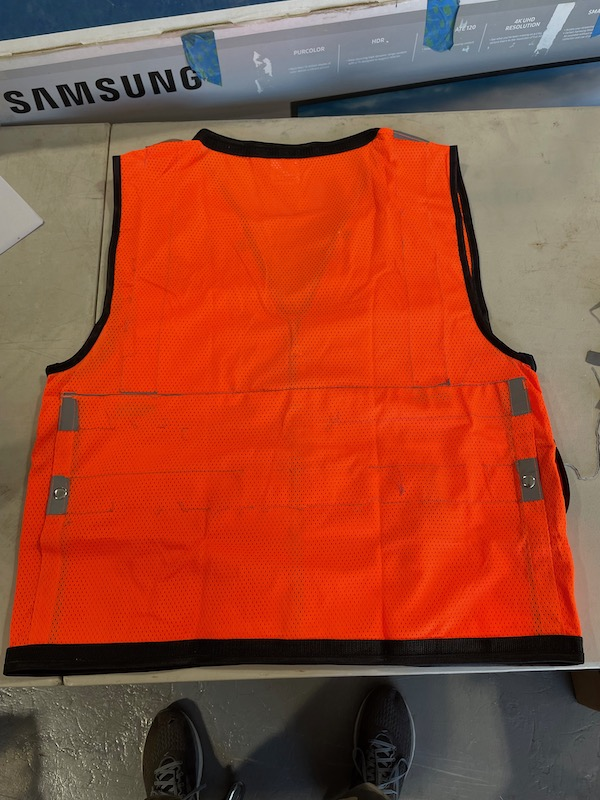
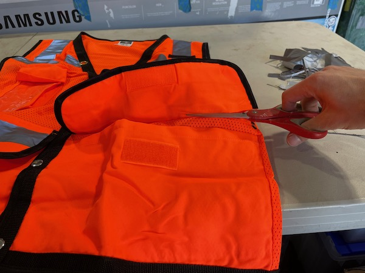
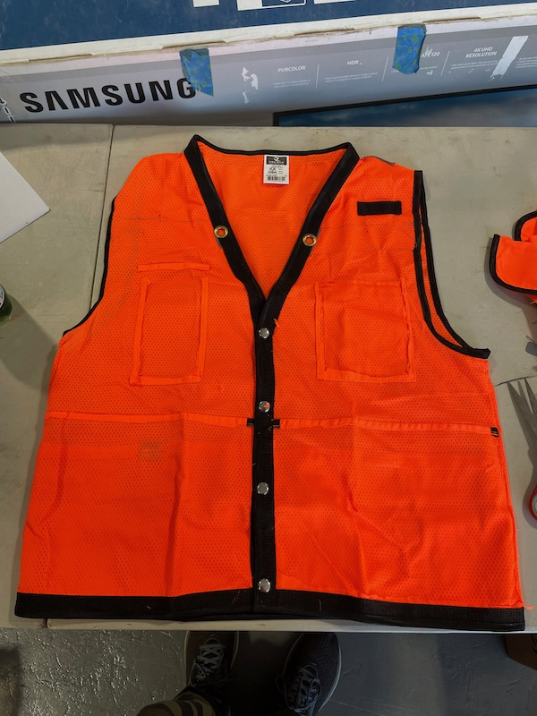

### Prepare the LED strands

If you have LED strands that are pre-cut to the right lengths (108, 108, and 144)
with JST connectors on both ends, you can skip this section.

First cut strands into lengths 108, 108 and 144. It's simplest to leave the start
of the strand as it already has a JST connector, and cut towards the end (there are
arrows on the strand from start to end). We then need to solder a JST cable from
the end of all three strands.

### Prepare the "Wiring Bouquet"

The "Wiring Bouquet" is a part that connects a USB A Male connector, a JST female
connector and a GROVE male connector together. See the Wiring Diagram section for
details. Ideally, the best option is to solder the wires and use heat shrink tubing
to protect them. If you don't have heat shrink tubing (or a heat gun) you can use
electrical tape instead. If you can't solder, you can use a lever nut or a butt
crimp connector.

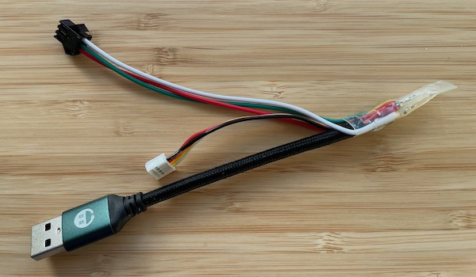
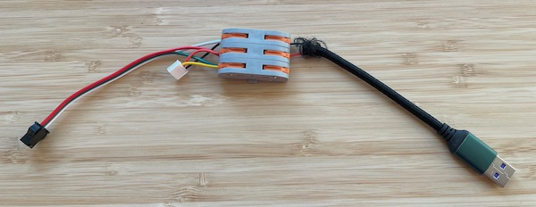

### Attach the LED strands to the vest ("Mass Production Phase 2")

Grab a USB battery, a controller, a "Wiring Bouquet", and plug them in.
Then turn on the test pattern: disable the button lock, then long-press
repeatedly until you see a question mark and then short-press.
If you have an "Assembly" controller it'll automatically boot into this mode.

Start with front left (left when wearing vest, so right when looking at it), using a
short LED roll (108). You can tell short from long rolls by the label on the metallic
bags they come in. Long ones have a sticker that says "4.8 M/ROLL", short ones either
say "3.6 M/ROLL" or have no sticker. Make sure you have the right roll length by
checking that the first LED is blinking red and last one is blinking green. When facing
vest, strand should start on top left and end on top right. Check photo and wiring
diagram for details. Top row should be red surrounded by green and bottom row should
be red surrounded by blue. use the colors of the test pattern to make sure LEDs of the
same color are aligned horizontally. Plug in a finished vest to see how it's supposed
to look.

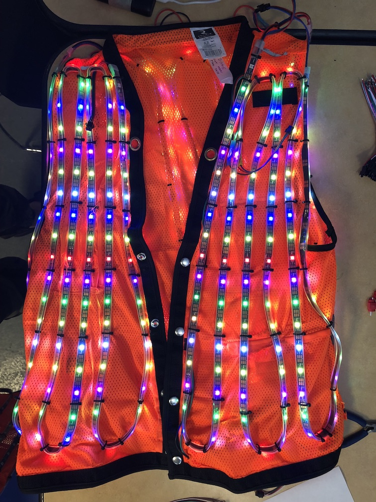

Use 3 or 4 inch zip-ties, and attach between LEDs. The zip-tie should slightly bend the
plastic waterproof insulation of the LED strand. WARNING: Do not tie the LED strands too
tight, especially around turns as that caused failures in the prototype. Make sure to attach
wires in zip-ties so they don't stick out while leaving enough slack so they can't get pulled
by the fabric. Once you've finished the front left, grab a long LED roll (144) for the back
(we do the back before the other side of the front), and connect its start to the end of the
one you just finished (DO NOT plug the controller into the second strand directly without going
through the first strand, otherwise the pattern will be wrong). Same as the first strip, check
that first and last LEDs are blinking. Once the back is done, grab another short strand (108)
and do the same on the front right of the vest. Make sure that the colors on the front right are
aligned with the ones on the front left when the snaps are closed on the vest. Check the wiring
diagram for the direction, it's from top left to top right. Once done you can cut all the extra
zip tie slack, but make sure to cut it as close as possible to the fastener because otherwise
they can get very sharp.

### Prepare the "Capacitor Sleeve"

The "Capacitor Sleeve" connects a capacitor (between 1 and 5 milliFaradays) to a male JST
connector. See wiring diagram for details. To get the best connection, you can use solder and
heat shrink tubing. Otherwise, lever connectors work too. IMPORTANT: most capacitors of this
size are direction dependent: they'll have a side with minuses on it. That side MUST be connected
to ground. If you get this wrong, the capacitor will explode and could injure someone.

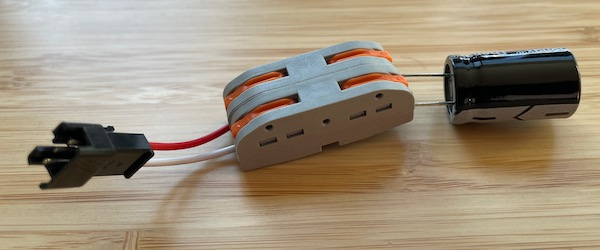

### Add Final Vest Wiring ("Mass Production Phase 3")

See Wiring Diagram below for details.

  * Add one male and one female JST connectors in the front left inner pocket
  * Connect them to three wires going up from there to the neck area (will be zip-tied behind first strand)
  * Connect JST connectors between neck area and LED strands
  * Plug the "Capacitor Sleeve" into the end of the last strand.

### Final Touches

Test the completed wiring by connecting a battery and controller inside the pocket
and making sure all LED strands are on.

Make sure none of the wires can get snagged on anything. Zip tie anything loose down.

## Wiring Diagram

The vest is made of three continuous LED stands:
  * 108 LEDs for front left (18 x 6)
  * 144 LEDs for back (18 x 8)
  * 108 LEDs for front right (18 x 6) 
The total makes a 18 high by 20 wide matrix of 360 LEDs.

[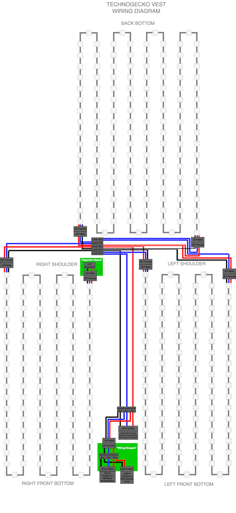](images/vestwiring.html)
